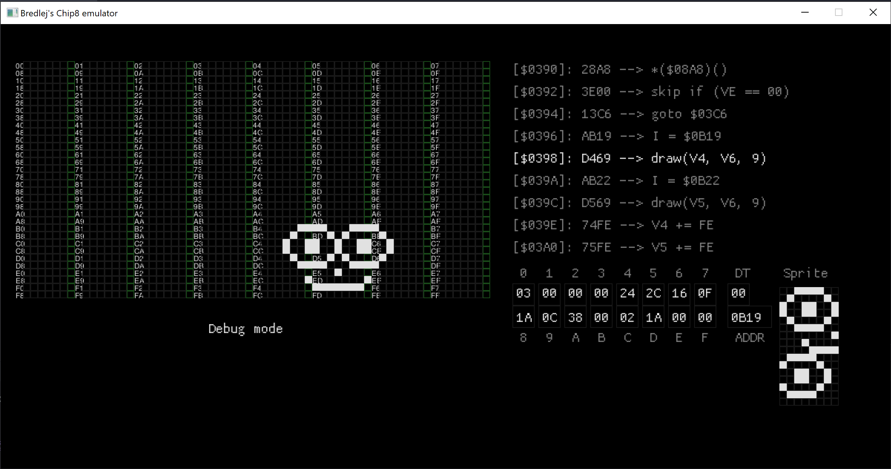

# chip8-emu
### About
Implementation of a [CHIP-8](https://en.wikipedia.org/wiki/CHIP-8) virtual machine written in C.

GUI is handled with the SDL2 library.

Features an output of the previous, current and future opcode instructions, relevant registers and a render of the contents of 
the **I** address register (often used for holding sprite data).

Also features a **Debug Mode** activated with *space bar* that enables the user to run single instructions one by one 
with the *down key*.

**Debug Mode** also overlays a grid with framebuffer positions which may come handy for ROM development and bugfixing.

[Unit-tests](test/test_chip8.c) are provided for its basic functionality and each implemented opcode.

### Missing features:
- Stack implementation
- 60Hz clock (currently runs unhindered at CPU in a while-loop, which may be delayed by SDL calls)
- Some opcode implementations (`0NNN`, `00E0`, `00EE`, `2NNN`, `EX9E`, `EXA1` and most `FXNN` opcodes)
- Sound (beeping)
- *other features may be missing which I don't remember now*

### Author
**Patryk Szczypień** - patryk.szczypien@gmail.com

### License
This project uses the MIT License with exception to external libraries which have they own licenses:
- SDL2
- Unity (unit testing library)
- PCG basic (PCG Random Number Generation for C.)

